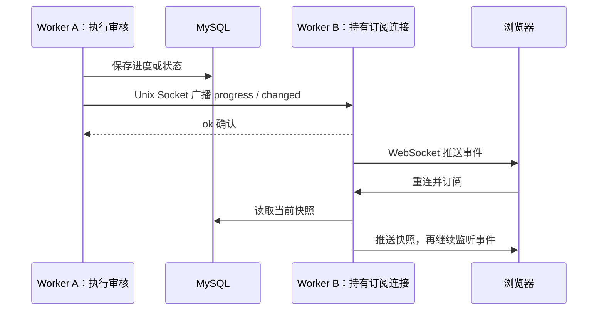

# 跨 API 进程共享与协调机制

记录日期：2026-09-10。当前部署是一个 API 容器、4 个 Gunicorn worker。各进程的 Python 内存独立，跨进程协调通过文件锁、MySQL 和 Unix Socket 完成。

并发验证见[审核并发测试记录](review-concurrency-tests.md)，运行参数见[审核并发配置](review-concurrency.md)。

## 1. 共享内容总览

| 内容 | 机制 | 当前共享范围 | 实现入口 |
|---|---|---|---|
| 综合审核任务名额 | 多个文件上的 `fcntl.flock` 排他锁 | 同一 API 容器的所有 worker | [review_scheduler.py](../api/review_scheduler.py)：`review_task_slot` |
| 任务状态、结果、进度 | MySQL `review_tasks` 表 | 连接同一数据库的进程 | [review_task_store.py](../api/review_task_store.py) |
| 进度及状态变更通知 | 每个 worker 建立 Unix Socket，互相广播 JSON 事件 | 可访问同一 Socket 目录的进程 | [review_events.py](../api/review_events.py)：`ReviewEventBus` |
| 人物库写入互斥 | 单个文件上的 `fcntl.flock` 排他锁 | 共用同一锁文件的进程 | [person_library.py](../src/wcm_facerec/person_library.py)：`library_write` |
| 人物图片文件 | 宿主机目录挂载至 `/tmp/wcm` | 当前 API 容器及配置了相同挂载的进程 | [compose.yaml](../compose.yaml)：API volumes |

进程之间没有通过共享 Python 字典或 `multiprocessing` 共享内存保存这些状态。

## 2. 综合审核任务名额

代码：[review_scheduler.py](../api/review_scheduler.py) 的 `review_task_slot`；调用入口：[routes.py](../api/routes.py) 的 `_run_review_task`。

251 容器中使用 `/tmp/wcm-review-slots/`，默认有 4 个名额，对应 `0.lock`～`3.lock`。本地路径由 `tempfile.gettempdir()` 决定。

1. 每个请求依次打开名额文件，尝试 `LOCK_EX | LOCK_NB` 非阻塞排他锁。
2. 成功锁住任意一个文件后，保留文件句柄，执行下载、审核及结果保存。
3. 没有空闲名额时，执行 `await asyncio.sleep(0.25)` 后再次尝试。
4. 退出异步上下文时关闭文件句柄，操作系统释放锁；进程退出也会释放其持有的锁。

锁定状态由操作系统维护，锁文件内容不保存计数。即使有 4 个 API 进程，总共也只能持有 4 个名额，而不是每个进程各运行 4 个任务。

**使用边界：**

- 队列采用竞争空闲名额的方式，不保证严格 FIFO。
- 不要删除正在使用的锁文件。删除后重建同名路径会产生不同文件，破坏对同一个锁对象的竞争。
- 所有参与者必须使用同一个目录和一致的并发配置。
- 等待中的审核仍依附所属 API 进程，不是能在进程重启后自动恢复的持久任务队列。
- 名额目前覆盖 `/analyze_media` 的 HTTP 和 WebSocket 综合审核入口；单项审核、人脸搜索不占这些名额。

跨进程验证入口：[test_review_scheduler.py](../tests/test_review_scheduler.py) 的 `test_slots_are_shared_with_other_processes_and_released_on_exit`。

## 3. MySQL 保存共享业务状态

代码：[review_task_store.py](../api/review_task_store.py)。

`review_tasks` 保存任务 ID、视频地址、参数、状态、审核结果、失败原因、覆盖率摘要和进度。各进程通过 `_connect()` 连接同一 MySQL；同步数据库操作由 `asyncio.to_thread()` 执行，避免直接阻塞事件循环。这里共享的是数据库记录，各进程不共用一个 Python 数据库连接对象。

| 操作 | 主要函数 | 行为 |
|---|---|---|
| 创建任务 | `create` / `_create_sync` | 先落库，再广播 created 事件 |
| 更新进度 | `update_progress` / `_update_progress_sync` | 仅更新仍在 processing 且新 sequence 更大的记录 |
| 保存结果 | `complete` / `_complete_sync` | 更新结果、覆盖率、终态及 finished 进度 |
| 标记失败 | `fail` / `_fail_sync` | 更新 failed 状态、失败原因和失败阶段 |
| 查询与订阅初始快照 | `get`、`get_summaries` | 从数据库读取当前状态 |

进度更新在同一条 SQL 中检查 `status = 'processing'` 和递增的 `sequence`，防止迟到进度覆盖新进度或将已结束任务改回处理中。多个进程启动时都可能初始化表结构，代码处理了新增列时的重复列竞争。

数据库中的记录可以被其他进程读取，但这并不表示运行中的审核协程可以在进程之间迁移或自动接管。

## 4. Unix Socket 广播事件

代码：[review_events.py](../api/review_events.py) 的 `ReviewEventBus`，以及 [review_stream.py](../api/review_stream.py) 的 `stream_review_tasks`、`push_review_progress`。

每个 worker 启动时创建独立 Socket：

```text
/tmp/wcm-review-events/worker-<PID>-<随机标识>.sock
```

[main.py](../api/main.py) 的 `lifespan` 负责启动与关闭事件服务。



关键处理：

- `publish()` 先投递给本进程监听者，再扫描其他 worker 的 Socket 并广播事件。
- 单个 peer 的发送限制为 0.5 秒；失效的唯一 Socket 路径会被清理。
- 每个本地订阅者有容量 128 的 `asyncio.Queue`。队列满时清空旧事件、发送 `resync`，订阅连接关闭后由客户端重连获取快照。
- 订阅时先注册监听，再读取数据库快照，避免读取快照期间发生的更新被错过。
- WebSocket 心跳默认 20 秒；事件发送失败不改变已保存的审核结果。

这些事件是实时通知，采用尽力投递，没有持久化消息队列或自动重放。数据库是任务状态的持久来源；peer 投递失败可能造成通知延迟或缺失，需要后续事件、重新查询或重连快照恢复视图。

跨进程验证入口：[test_review_stream.py](../tests/test_review_stream.py) 的 `test_worker_events_cross_process_without_external_service`。

## 5. 人物库写入锁与图片共享

代码：[person_library.py](../src/wcm_facerec/person_library.py) 的 `library_write`；使用位置见 [face_engine.py](../src/wcm_facerec/face_engine.py) 中的 `@library_write`，包括注册、合并、更新、删除等写操作。

锁文件为 `/tmp/wcm/.person-library.lock`。所有受此装饰器保护的写操作共用一个排他锁；拿不到锁时异步等待 100ms 后重试。读取不经过这个写锁。

与审核任务名额不同，人物库写入使用 `asyncio.shield()`：客户端取消时仍等待已经开始的写入或补偿完成，随后才释放锁，避免底层 SDK 线程仍在写入时另一进程进入。

人物图片位于 `/tmp/wcm`，通过 Compose bind mount 对接宿主机目录；人物元数据及检索由所有 worker 连接同一个 InsightFace Server 服务处理。文件共享、上游数据共享和写操作互斥是不同职责。

## 6. 只在单个视频或进程内共享的状态

| 状态 | 实际作用域 | 代码 |
|---|---|---|
| 四模型的最近 10 次调用统计 | 每个视频一个 `ModelHealth`，各模型单独计数；通过 `ContextVar` 将同一对象传给该视频的子协程 | [model_health.py](../api/model_health.py)：`protect_video_review` |
| 窗口队列、消费者、已完成窗口 | 单个视频任务 | [review_windows.py](../api/review_windows.py)：`analyze_video`；[handlers.py](../api/handlers.py)：`_process_analyze_media` |
| OCR / face / guard / visual 去重缓存 | 单个视频任务，含共用在途请求 | [review_windows.py](../api/review_windows.py)：`AsyncMemo` |
| 进度对象及其 `asyncio.Lock` | 单个任务，用锁协调进度上报；上报后的快照才写入数据库 | [review_progress.py](../api/review_progress.py)：`ReviewProgress` |
| FaceEngine 单例 `_engine` | 每个 API 进程各一份，连接同一个外部人脸服务 | [face_engine.py](../src/wcm_facerec/face_engine.py)：`get_face_engine` |
| 事件监听者集合与本地订阅队列 | 每个 worker 各一份，通过 Socket 收到事件后本地投递 | [review_events.py](../api/review_events.py)：`listeners` / `subscribe` |

`ContextVar`、`asyncio.Queue`、`asyncio.Lock` 和普通模块全局变量本身均不是跨进程共享机制。因此，一个视频触发模型失败保护不会让其他视频直接继承其失败计数。

## 7. 多容器或多机部署边界

当前任务名额目录和事件 Socket 目录位于 API 容器本地临时目录。增加容器副本后，名额上限和事件广播不会自动跨容器统一；连接同一个 MySQL 只能共享业务记录，不能自动补齐这两项协调。

人物库图片目录及写锁的作用范围由实际挂载决定。跨主机文件锁语义不能仅凭目录名相同推定成立。

若以后扩展为多容器或多机，需要单独设计全局任务调度、事件传播和任务恢复机制。本文记录当前实现，不表示已经具备这些分布式能力。
