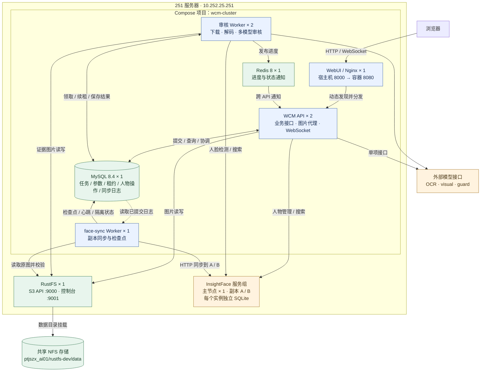
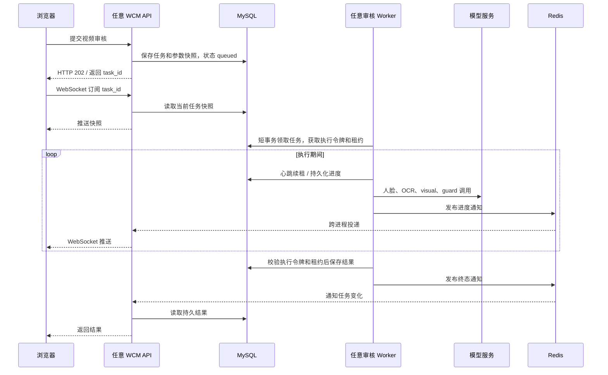
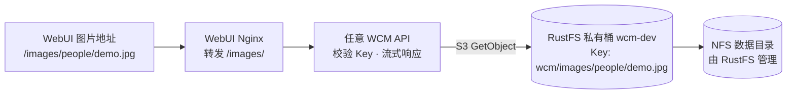
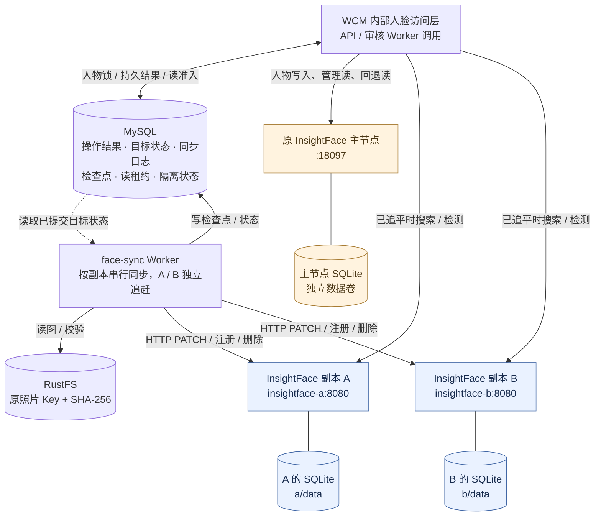
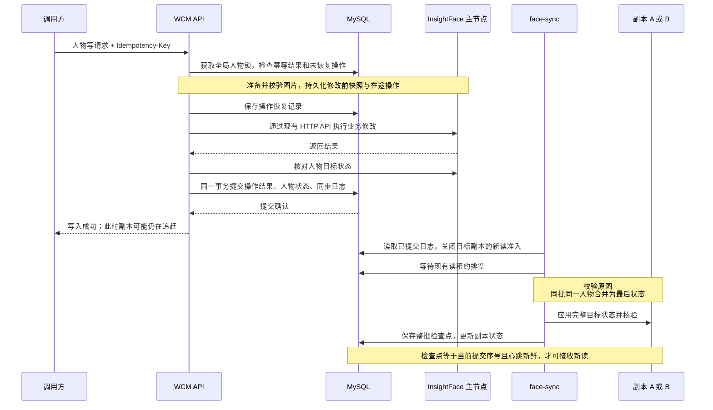

# WCM 当前部署架构

拓扑核对时间：2026-09-15 11:17（UTC+8）。架构基线版本：`2a3cd68`，分支：`codex/cluster-architecture`。
后续系统管理入口更新见文末；当前运行版本以服务器 `DEPLOYED_COMMIT` 为准。

本文记录 251 服务器上已经部署的架构。当前具备 API、审核执行和人脸检索的多实例能力；
这些实例仍运行在同一台服务器上，尚未形成跨服务器高可用集群。

## 1. 整体架构

WebUI 独立构建和部署，内置的 Nginx 同时提供静态页面、API 负载均衡和图片入口。
审核 Worker 从 MySQL 领取任务；人脸同步 Worker 从 MySQL 读取已提交的同步日志。
两类 Worker 均独立于 API 的请求生命周期。



图中连线表示主要调用或数据流；响应沿原连接返回。InsightFace 服务组内的写入、同步和读路由见第 4 节。
人脸业务逻辑目前在 WCM 的 `FaceEngine`、适配器及人物操作模块内，尚未拆成独立的人脸业务 API 服务。
API、审核 Worker、face-sync 共用后端镜像，通过不同启动命令承担不同职责；WebUI 使用独立镜像。

### 实例、端口与部署位置

| 组件 | 当前数量 | 访问地址或容器端口 | 部署位置 / 说明 |
|---|---:|---|---|
| WebUI / Nginx | 1 | `http://10.252.25.251:8000` → `webui:8080` | `/home/aigc/wcm-cluster`；独立前端镜像 |
| WCM API | 2 | `api:8000`，不发布宿主机端口 | Docker DNS 动态发现；不依赖固定容器名 |
| 审核 Worker | 2 | 无对外入口 | `python -m api.worker` |
| 人脸同步 Worker | 1 | 无对外入口 | `python -m api.face_sync_worker`；A、B 分别追赶 |
| MySQL | 1 | `mysql:3306`；宿主机 `127.0.0.1:13307` | 独立卷 `wcm-cluster_mysql-data`，业务库 `wcm` |
| Redis | 1 | `redis:6379`，不发布宿主机端口 | 当前关闭持久化，仅承载通知 |
| InsightFace 主节点 | 1 | `http://10.252.25.251:18097` → 容器 `8080` | 原部署 `/opt/binarii/insightface-server` |
| InsightFace 副本 A / B | 2 | `insightface-a:8080` / `insightface-b:8080` | 不发布宿主机端口；使用原主节点的固定镜像 |
| RustFS | 1 | S3：`10.252.25.251:9000`；控制台：`:9001` | 独立 Compose 项目，目录 `/opt/binarii/rustfs-dev` |
| 外部模型接口 | 按配置调用 | `https://models.ai.wtvdev.com/v1/chat/completions` | OCR、visual、guard；其内部部署不在本项目管理范围内 |
| 旧版备用 WCM | 1 | `http://10.252.25.251:8001` | `/home/aigc/wcm`，不参与新队列和同步协调 |

旧版 8001 仍连接同一个 InsightFace 主节点，因此它不是一份独立的人物库快照。
**正常人物写入统一经过新版 WCM；旧版、自带管理页和独立脚本不能绕过新版同步日志并行写入。**

## 2. 审核任务、执行租约与进度通知



- **MySQL 是任务状态依据。** 任务领取使用短事务和 `FOR UPDATE SKIP LOCKED`；结果写入检查执行令牌及租约，过期执行者不能覆盖新结果。
- **任务不依附浏览器或 API。** 页面关闭、WebSocket 断开、API 重启不会取消已提交任务。Worker 故障后可由其他 Worker 重新执行整段视频，当前没有窗口级断点续跑。
- **Redis 只传通知。** 通知丢失或重连后从 MySQL 重新取得快照；不能用 Redis 是否收到消息判断任务是否完成。
- **临时文件属于执行实例。** 视频下载、解码和任务内缓存可丢弃；需要长期访问的图片进入 RustFS，任务结果进入 MySQL。

核对时的有效配置：审核总并发 `4`、每个 Worker 并发 `2`、视频窗口并发 `6`；任务租约 `60 秒`、心跳 `5 秒`、最多尝试 `3 次`。
模型请求的集群总上限分别为 InsightFace `4`、OCR `8`、visual `6`、guard `8`，由 MySQL 连接持有的全局名额协调。
增加容器数量不会自动提高这些上限。业务参数在任务提交时保存快照，调度及模型准入上限使用实时配置。

## 3. 图片与 RustFS 的映射

人物资料只保存完整对象 Key，Bucket、Endpoint 和访问凭据由 WCM 配置提供。例如：

```json
{
  "image_key": "wcm/images/people/demo.jpg",
  "image_keys": ["wcm/images/people/demo.jpg"]
}
```



| 项目 | 当前配置 |
|---|---|
| S3 Endpoint | `http://10.252.25.251:9000` |
| Bucket | `wcm-dev` |
| 对象前缀 | `wcm/images` |
| RustFS 宿主机数据目录 | `/mnt/loong.nfs.com/ptjszx_ai01/rustfs-dev/data` |
| RustFS 容器挂载点 | `/data` |

浏览器通过 WCM 访问图片，不需要 S3 凭据。图片接口保留 `GET`、`HEAD`、`Range`、`ETag` 和缓存支持。
API、Worker 和同步进程都通过 S3 协议访问对象；只有 RustFS 挂载上述 NFS 目录，WCM 不直接读取 RustFS 内部文件布局。
上传后保存对象 Key，人物同步日志保存 Key 和 SHA-256；同步副本需要图片时从 RustFS 读取并校验。

旧 `file_path/image_paths` 仍可兼容读取，新字段优先。迁移不会移动图片对象或重新注册人脸。
2026-09-15 已完成跨受管集合的 **9,803 条人物资料**迁移，详见[图片对象 Key 与回滚](image-object-keys.md)。

## 4. InsightFace 主节点、独立副本与可靠同步

### 4.1 数据与实例边界



三个人脸实例使用原 InsightFace CPU 镜像，SQLite 格式保持不变。主节点不向副本做数据库复制；
WCM 使用现有 HTTP API 将已提交的完整人物目标状态应用到副本。
Nginx 只对 WCM API 做负载均衡，不使用 `mirror` 承担可靠复制，也不随机拆分一次人脸查询的多个子请求。

| 数据 / 文件 | 位置与所有权 |
|---|---|
| 主节点 SQLite | Docker 卷 `insightface-simple-cpu-data`，容器内 `/data/insightface-server.db` |
| 副本 A 数据 | `/home/aigc/wcm-cluster/insightface-replicas/a/data` → A 的 `/data` |
| 副本 B 数据 | `/home/aigc/wcm-cluster/insightface-replicas/b/data` → B 的 `/data` |
| 模型文件 | `/opt/binarii/insightface-server/.models`，各实例只读挂载 |
| 人物元数据与人脸记录 | 每个 InsightFace 实例各自持有；WCM MySQL 保存已提交人物状态及恢复日志 |
| 原照片 | RustFS，共享对象，不依赖 API / Worker 本地文件 |

**三个运行中的实例不共享 SQLite 数据目录。** 共享的是只读模型文件和通过 S3 访问的原照片。

### 4.2 写入成功的含义



成功响应表示**主节点修改完成，且 MySQL 已持久化操作结果和同步日志**，不表示所有副本已同步完成。
InsightFace 的 SQLite 写入和 MySQL 事务不能原子提交，跨服务部分依靠操作日志、幂等结果、补偿与隔离恢复处理。

元数据变化通过 `PATCH` 同步；照片集未变时不重新注册人脸。照片变化只重建受影响人物，
副本每批合并同一人物的多次修改，减少重复推理。新副本从原生一致性备份建立基线后才开放读取。

### 4.3 读取一致性与故障边界

| 场景 | 当前行为 |
|---|---|
| 人物管理列表、统计、同名查询 | 固定读主节点，并与人物写锁协调 |
| 搜索 / 检测 | 只选择 `ready`、心跳新鲜、`applied_seq = committed_sequence` 的副本 |
| 一次搜索的后续人脸框查询 | 检测、搜索和 `matched_face_id` 回查固定在同一个实例 |
| 没有可读副本 | 回退到受写锁保护的主节点；有未恢复主节点操作时拒绝读取部分状态 |
| 副本写入前已不可达 | 退出读池并退避，恢复后自动追赶 |
| 副本写入结果不确定，或同步执行者中途退出 | 隔离副本；先终止旧执行者及在途请求，再显式恢复 |
| 主节点写入或补偿结果不确定 | 保留恢复记录，阻止继续写入；完成隔离后恢复 |
| 副本数据卷丢失 | 从一致性备份恢复并重新核验；空库不能直接进入读池 |

这里保证受管人物、照片集和元数据的一致性，不要求每个实例内部生成的 `face_id`、SQLite 文件字节或重新推理后的浮点分数完全相同。
历史缺少完整原图的记录标记为 `rebuildable=false`，需要原生备份保留完整人脸；普通业务修改受限。
图片 Key 迁移仅改变元数据，并额外核对这类记录的人脸指纹。

恢复必须按[InsightFace 可靠副本同步](insightface-replication.md)执行。
`--fenced` 表示操作者已经完成旧执行者和在途请求的隔离；单纯清除隔离状态或重启同步 Worker 不等于安全恢复。

## 5. 当前能力与后续扩展边界

| 方面 | 当前状态 | 跨服务器部署还需处理 |
|---|---|---|
| API / 审核执行 | 各 2 实例，共享任务、图片及全局协调 | 跨主机服务发现、入口分发和统一网络配置 |
| WebUI | 独立镜像，Nginx 动态发现同一 Compose 网络内的 API | 多入口实例和入口高可用 |
| InsightFace | 1 个写主节点、2 个可准入读副本 | 多主机隔离流程、数据卷与模型分发；当前没有自动主节点提升 |
| MySQL | 单实例，保存任务、参数和可靠日志 | 数据库自身的高可用、备份及恢复演练 |
| Redis | 单实例通知服务，状态可由 MySQL 重建 | 通知服务可用性；继续保留快照校准 |
| RustFS / NFS | RustFS 单实例，数据位于已有 NFS 挂载 | 对象存储与底层 NFS 的故障域、备份和可用性方案 |
| 主机故障 | 251 上的应用与人脸实例共同受影响 | 将副本和基础设施分散到不同主机 |

当前部署没有 PostgreSQL / pgvector，也没有替换 InsightFace 的数据库。
API / Worker 的业务协调已支持多实例，但现有 Compose 的 Docker DNS、依赖关系和副本本地目录不会自动扩展到其他主机。

恢复资料应成套保留：**MySQL 操作及同步日志、RustFS 原照片、带提交序号的 InsightFace 一致性备份**。
8001 旧版不识别新图片字段，回退前必须完成字段回滚和副本追平；旧版使用本地图片时，还需准备新增图片的本地副本。

## 6. 本次核对结果与维护入口

- 新架构 Compose 项目共 **10 个容器**：WebUI 1、API 2、审核 Worker 2、face-sync 1、InsightFace 副本 2、MySQL 1、Redis 1；核对时全部健康。
- 原 InsightFace 主节点、RustFS 和旧版 WCM 分属各自部署项目，核对时均健康。
- 核对时已提交序号为 **9805**，副本 A / B 均为 `ready`、落后序号差 `0`，主节点待恢复操作 `0`。这些数值是时间点记录，运行后会变化。
- 图片 Key 迁移后核对了主节点及两副本的 9,803 条人物资料；21,551 条原生人脸样本指纹与迁移前一致。这是本次元数据迁移验收结果，不是后续照片重建的字节一致性承诺。
- 对应部署与验收记录：251 的 `/home/aigc/wcm-cluster/backups/image-keys-deployment.json`。

| 维护内容 | 文档 / 代码入口 |
|---|---|
| 多实例启动、审核任务与部署 | [集群部署](cluster-deployment.md)、[Compose](../compose.yaml)、[WebUI 镜像](../Dockerfile.webui)、[Nginx](../deploy/nginx.conf) |
| 人脸同步、基线和故障恢复 | [同步运行手册](insightface-replication.md)、[副本 Compose](../compose.insightface.yaml)、[同步 Worker](../api/face_sync_worker.py) |
| 图片字段、迁移和回滚 | [图片对象 Key](image-object-keys.md)、[共享图片实现](../src/wcm_facerec/image_store.py) |
| 任务执行与事件通知 | [任务队列](../api/task_queue.py)、[审核 Worker](../api/worker.py)、[事件服务](../api/review_events.py) |
| 人物操作与同步状态 | [人物操作日志](../src/wcm_facerec/person_operations.py)、[同步状态存储](../src/wcm_facerec/face_sync_store.py) |

历史文档中的单容器、Unix Socket 广播、本地图片路径描述对应较早版本；判断当前拓扑和图片格式时，以本文及图片 Key、可靠同步文档为准。
修改实例、入口、存储或同步协议时，应同时更新本文，并重新核对 251 的部署。

### 系统管理入口（后续功能更新）

WebUI 的“系统管理”菜单（`/#/system`）使用 WebSocket pull 查询 InsightFace 提交序号、副本落后数量、心跳、读准入和隔离原因。
浏览器连接 `/api/v1/insightface/replication/ws`，发出 `status` 请求后由 API 查询 MySQL 并返回对应 `request_id` 的快照；
收到结果 5 秒后发起下一次查询，“刷新状态”也走同一连接。服务端不主动推送或定时查询；断线自动重连，隐藏页面停止查询。
支持全部可用副本或单个副本的手动同步：API 将请求写入 MySQL `face_sync_requests`，原 face-sync Worker 负责检查、追赶及完成确认。
同一副本的未完成请求会合并；普通重试可提前触发，隔离或未初始化状态不会被按钮解除。
该入口没有增加独立执行服务，部署实例数和前述可靠同步链路保持一致；详见[同步运行手册](insightface-replication.md)。
