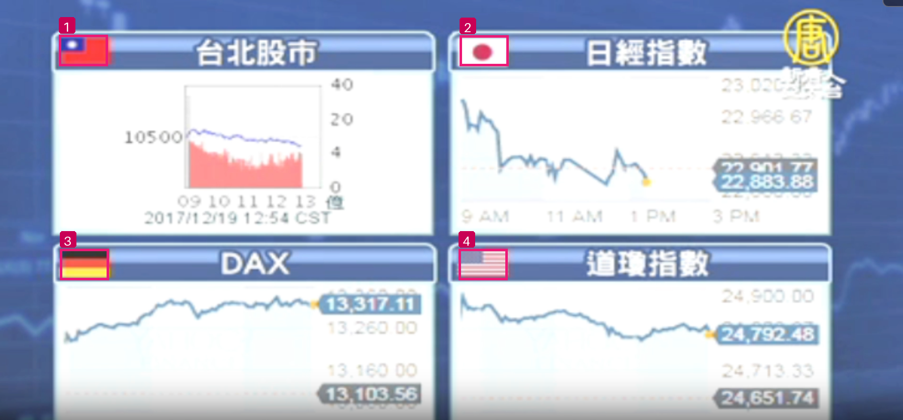

# 用户财经截图：国旗 bbox 实测

2026-09-18，调用 `WasuAI/Qwen3.8-27B-Abliterated` 对用户提供的 1796×836 原始 PNG 单独推理，未裁剪、缩放或重编码输入，也未把旗名、数量和位置告诉模型。

第二次提示下，4 个旗帜均检出并返回具体名称，无额外目标；HTTP 200，`finish_reason=stop`，耗时 **3.212 秒**。

| ID | 模型原始名称 | bbox_2d（0–1000） | 换算后的像素框 |
|---|---|---|---|
| 1 | 中华民国国旗 | [65,83,119,157] | [117,69,214,131] |
| 2 | 日本国国旗 | [509,84,563,157] | [914,70,1011,131] |
| 3 | 德国联邦共和国国旗 | [66,592,120,666] | [119,495,216,557] |
| 4 | 美利坚合众国国旗 | [508,592,562,666] | [912,495,1009,557] |

坐标顺序均为 `[xmin,ymin,xmax,ymax]`。像素坐标由实际输入宽高换算、四舍五入，没有手工修正模型框。



第一轮同样检出 4 个框（3.382 秒），但把所有 label 照抄为 JSON 示例中的“旗帜名称”。第二轮删除具体示例占位值，明确要求输出根据图像识别的真实名称，得到上表。两轮都在 JSON 外添加了 Markdown 围栏。

相对于调用前人工目视标注的参考框，两轮框定位均为 4/4（IoU≥0.5），第二轮平均最佳 IoU≈0.870。输入有模糊边缘，人工参考框本身有数像素不确定性；该值用于定位误差参考，不是严格数据集准确率。个别框略微切入旗帜边缘。
本轮只请求旗帜，因此右上角电视台标不计入目标。

文件：

- [原图](user-flags.png)、[参考框及原图 SHA-256](manifest.json)。
- [第一轮提示](prompt.txt)、[第二轮提示](flags-names.txt)。
- [第一轮完整响应](responses-normalized.jsonl)、[第二轮完整响应](responses-normalized-names.jsonl)。
- [归一化与像素检测结果](detections.json)、[可视化对照报告](report.html)、[统计](summary.json)。
- [受控样本实验与官方资料](../2026-09-18-flag-logo-bbox/README.md)：官方 grounding 示例使用 0–1000 坐标；此前测试发现直接要求像素坐标容易混用单位，故本图使用归一化方案。

模型参数为 temperature=0、max_tokens=2048；两次请求各自独立，无聊天历史、无自动重试。推理使用部署已有模型网关及 visual 名额，未创建业务审核任务、未改变服务版本。

原图、结果和脚本独立归档到 251 的 `/home/aigc/wcm-cluster/evaluations/2026-09-18-user-flags/`；本地仍在 `codex/object-detection-evaluation` 分支。未改动 8000/8001 业务部署。

在有网关配置的项目环境重跑：

```sh
uv run python -m scripts.eval_flag_logo_bbox run docs/model-evaluations/2026-09-18-user-flags/manifest.json --coordinates normalized --prompt-file docs/model-evaluations/2026-09-18-user-flags/flags-names.txt
```

输出为 JSONL；使用新文件保存新的响应，保留本次记录。
